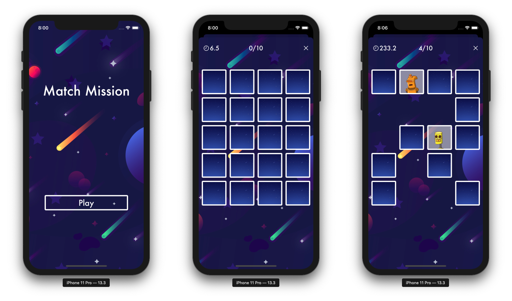

#  Match Mission

<h3> A memory matching game with an intergalactic space-robots theme for iOS13+ </h3>

<h3> Your Mission: Find All Matching Pairs of Robots </h3>

- Turn over any two cards at a time
- If they match, you've found a pair
- If they don't, they'll turn back over 
- Remember which robots you saw and where
- The game ends when you've found all matching pairs and you'll get to see how fast you completed your mission
- Play again and again; a random set of robots will be dispatched for you!

Credits: 

- Robot image api from: <a href="https://shopicruit.myshopify.com/admin/products.json?page=1&access_token=c32313df0d0ef512ca64d5b336a0d7c6">Shopify</a> 
- Background and icon images from: <a href="http://www.freepik.com">Freepik</a> 
